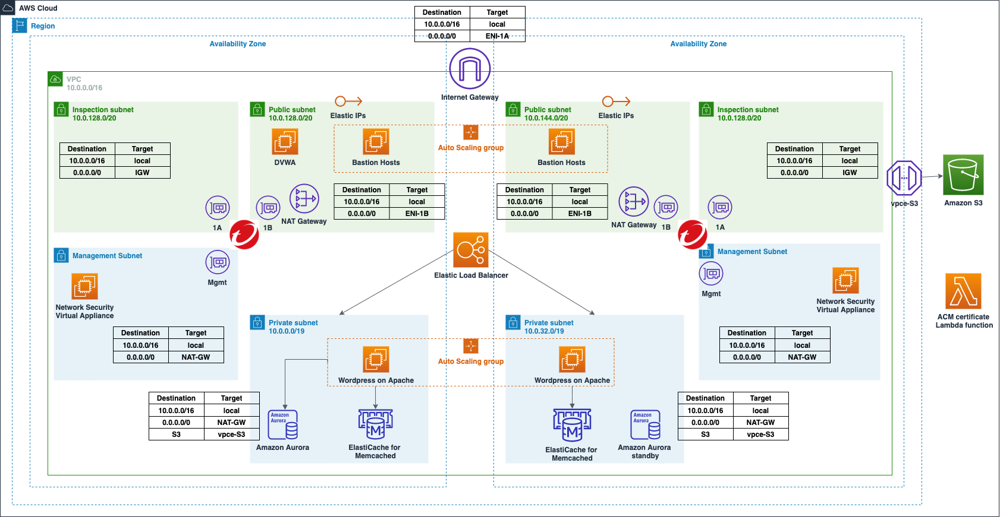

# quickstart-network-security-edge-deployment
## Network Security Edge Deployment in WordPress High Availability DVWA environment on AWS Cloud

Note: This Quick Start is an adaptation of original [Wordpress High Availability By Bitnami](https://github.com/aws-quickstart/quickstart-bitnami-wordpress). The original quickstart has been modified to include DVWA instance in the deployment. 

This Quick Start deploys WordPress High Availability by Bitnami, which includes WordPress and Amazon Aurora, in a highly available environment on AWS in about 40 minutes. It also deploys Damn Vulnerable Web Application (DVWA) in one of the public subnets. The purpose of this quickstart is to provide users a sample environment where they can deploy Network Security Virtual Appliance to protect their resources including web servers and databases etc.

After deploying this Quick Start, you will be able to:

- Deploy Network Security Virtual Appliance (NSVA) as an [Edge Protection](https://cloudone.trendmicro.com/docs/network-security/option1/)
- Configure your security profile in Cloud One Network Security console by distributing various Intrustion Prevention (IPS), Geo Filters to prevent your resources from inbound and outbound attack.
- Perform various inbound and outbound attacks to validate protection.
- Access logs of Network Security Virtual Applicance (NSVA) to verify which filters are getting triggered.

## Quick Start architecture for WordPress High Availability by Bitnami and DVWA on AWS

## Deployment Steps

### 1. Deploy sample Wordpress environment with DVWA 
The Quick Start offers two deployment options:

- Deploying WordPress High Availability by Bitnami and DVWA into a new virtual private cloud (VPC) on AWS
- Deploying WordPress High Availability by Bitnami and DVWA into an existing VPC on AWS

For architectural details, best practices, step-by-step instructions, and customization options, see the 
[Bitnami quickstart deployment guide](https://fwd.aws/arqWN).

Before proceeding to deploy the Quick Start, please create a new SSH key pair for DVWA instance in the AWS region you will be deploying the Quick Start to. You may use the same key pair as the one you created for Bastion hosts if you don't want to create an additional keypair.

Below are the additional parameters for DVWA Configuration that the Quickstart uses:
### DVWA Configuration

| Parameter label (name)                                   | Default        | Description        |
| :--------------------------------------------------------| :------------- | :--------------- |
| DVWA Instance Type (DVWAInstanceType)                    | t2.micro       | Amazon EC2 instance type for the DVWA instance            |
| Allowed DVWA External Access CIDR (DVWARemoteAccessCIDR) | 127.0.0.1/32   | The CIDR IP range that is permitted external SSH access to the bastion host instances. We recommend that you set this value to a trusted IP range |
| SSH KeyPair Name (DVWAKeyPairName)                       | Requires input | A public/private key pair, which allows you to connect securely to your instance after it launches. When you created an AWS account, this is the key pair you created in your preferred region |

### 1. Deploying Network Security to your environment

After the CloudFormation stack is successfully deployed, please use the deployment wizard in your CloudOne Network Security console to deploy Network Security Appliance in your environment. For detailed step-by-step instructions on deploying Network Security please check [Deploy Protection](https://cloudone.trendmicro.com/docs/network-security/add_cloud_accounts_appliances/) section

Once the Network Security Virtual Appliances have been succcessfully deployed, make sure they are visible in the CloudOne console and are reporting 'Active' status.

Your environment is now ready to inspect inbound and outbound traffic!

### 1. Perform IPS, Geo and SQL Attacks

Before performing attacks in the table below, please perform the following steps:
1. Configure respective filter to Block and Log mode in Cloud One console. For detailed steps please check [Customize filter settings using the GUI](https://cloudone.trendmicro.com/docs/network-security/Customize_filter_settings_GUI/)
2. Distribute profile with filter overrides. For detailed steps please check [Distribute filter overrides to your network](https://cloudone.trendmicro.com/docs/network-security/Filter_overrides_GUI/)