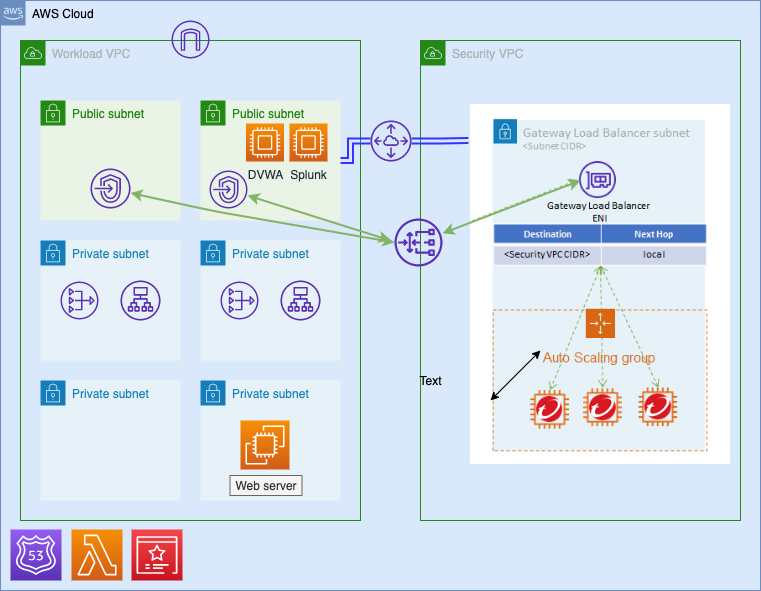

# centralized-deployment-with-gwlb

## Network Architecture

## Deployment Steps

*Note: You can deploy this Quick Start using the default S3 template link below if you don't wish to make changes to this code and deploy with your own customized changes:*

`https://quickstart-ns-edge-deployment.s3.us-west-1.amazonaws.com/centralized-with-gwlb/Master.yaml`
### 1. Deploy Cloud One Network Security with Centralized Security VPC
The Quick Start offers two deployment options:

- Deploying Cloud One Network Security with centralized security VPC without High Availability
- Deploying Cloud One Network Security with centralized security VPC with High Availability

Before proceeding to deploy the Quick Start, please create a new SSH key pair in the AWS region you will be deploying the Quick Start to.

Below are the parameters for Quick Start:
#### Quick Start Parameters

| Parameter label (name) | Default        | Description                                                    |
| :----------------------| :------------- | :------------------------------------------------------------- |
| AllowIP    | 127.0.0.1/32   | Only the IP entered here will be able to access the web server |
| BucketName | quickstart-ns-edge-deployment   | Name of the bucket where the template is placed |
| BucketPrefix    | centralized-with-gwlb/ | Bucket prefix |
| BucketRegion    | us-west-1| Bucket region |
| SSMAccess    | true | If enabled, SSM access to the instance will be available |
| DeployHTTPS    | false | If enabled, The HTTPS site will be deployed |
| DeployC1NS    | true | If enabled, C1NS with be deployed in centralized Security VPC  |
| DomainName    | nonymass-nemo.uk | [Required: 'DeployHTTPS' must be set to true] Domain name to be used for the website |
| SubDomain    | '' | [Required: 'DeployHTTPS' must be set to true] Subdomain to be used for the ALB. |
| HostZoneID    | Z085817336XNWEPQIO5DS | [Required: 'DeployHTTPS' ID of the HostZone where the domain you want to use is registered |
| DeploySplunk    | false | [Required: 'DeployC1NS' must be set to true] Subdomain to be used for the ALB. |
| DeploySplunk    | false | [Required: 'DeployC1NS' must be set to true] If enabled, Splunk Server will be deployed |
| DeploySplunk    | false | [Required: 'DeployC1NS' must be set to true] If enabled, Splunk Server will be deployed |