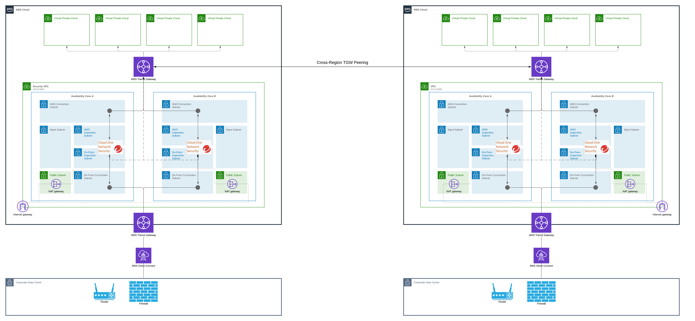

# east-west-deployment

## Network Architecture

## Deployment Steps

*Note: You can deploy this Quick Start using the default S3 template link below if you don't wish to make changes to this code and deploy with your own customized changes:*

`https://quickstart-ns-edge-deployment.s3.us-west-1.amazonaws.com/east-west-deployment/templates/main.yaml`
### 1. Deploy Network Security East West Outbound Only Inspection
The Quick Start deploys Security VPC for East West Outbound Only inspection in multiple AZs using Transit Gateways. Users are expected to deploy attacker and victim VPCs manually (instructions are given below)

Following are pre-requisites that must be fulfilled before you could deploy the Quick Start:
- Create a new SSH key pair in the AWS region you will be deploying the Quick Start
- [Generate a CloudOne API Key](https://cloudone.trendmicro.com/docs/network-security/add_cloud_accounts_appliances/#generate-an-api-key)

Below are the parameters for Quick Start:
#### Quick Start Parameters

##### Required parameters
| Parameter label (name) | Default        | Description                                                    |
| :----------------------| :------------- | :------------------------------------------------------------- |
| IpsInstanceType    | c5n.4xlarge  | AWS EC2 IPS instance type |
| KeyPairName | None | SSH Key to access instances |
| VpcCidr    | 10.0.0.0/24 | CIDR for the Security VPC. Each Availability Zone uses a /25 CIDR |
| ApiKey    | None | CloudOne API key you want to use |
| AvailabilityZones  | None | Availability Zones to use. Each uses a /25 subnet of the VPC |
| NumAvailabilityZones    | 2 | Number of Availability Zones chosen - to help with CloudFormation. Each uses a /25 CIDR and an Elastic IP |
| QSS3BucketName    | quickstart-ns-edge-deployment | S3 bucket name for the Quick Start assets |
| QSS3KeyPrefix    | east-west/ | S3 key prefix for the Quick Start assets |

### 2. Deploy Victim, Attacker VPC and Transit Gateway

Once Quick Start deployment is finished, Network Security Appliance is successfully registered with Cloud One Network Security. However, appliance is not inspecting any traffic at the moment since there are no workload VPCs connected to it. Below are additional steps to setup a victim and an attacker VPC.

1. Create attacker VPC with following:
   * VPC CIDR: 192.168.0.0/16
   * attacker-private subnet with CIDR: 192.168.0.0/24
   * attacker-public subnet with CIDR: 192.168.1.0/24
   * Internet Gateway attached to VPC
2. Create victim VPC with following:
   * VPC CIDR: 172.16.0.0/16
   * victim-private subnet CIDR: 172.16.0.0/24
   * victim-public subnet CIDR: 172.16.1.0/24
   * Internet Gateway attached to VPC
3. Create Transit Gateway (TGW)
4. Create TGW attachment between TGW and attacker-private subnet
5. Create TGW attachment between TGW and victim-private subnet
6. Create TGW attachment between TGW and NSAwsConnectionSubnet in each AZ
7. Delete all attachments and propogations on default route table for TGW
8. Create TGW route tables as per instructions [here](https://cloudone.trendmicro.com/docs/network-security/GWLB_CFdeploy2/)
9. Add following routes in each sanitized subnet route table:  
   * attacker VPC CIDR -> TGW
   * victim VPC CIDR -> TGW
10. Create a route table for attacker-private subnet. Add following route:
    * 0.0.0.0/0 -> TGW
11. Create a route table for attacker-public subnet, Add following route:
    * 0.0.0.0/0 -> IGW
12. Create a route table for victim-private subnet, Add following route:
    * 0.0.0.0/0 -> TGW
13. Create a route table for victim-public subnet, Add following route:
    * 0.0.0.0/0 -> IGW
14. Associate private and public route tables to respective private and public subnets
15. Create security group named "attacker" with following inbound rules:
    
    Type: SSH, Protocol: TCP, Port Range: 22, Source: 192.168.0.0/16
16. Create security groups named "attacker-bastion" with following inbound rules:
    
    Type: SSH, Protocol: TCP, Port Range: 22, Source: your_public_ip
17. Create security groups named "victim" with following inbound rules:
    Type: SSH, Protocol: TCP, Port Range: 22, Source: 172.16.0.0/16
    Type: HTTP, Protocol: TCP, Port Range: 80, Source: 192.168.0.0/16
18. Create security groups named "victim-bastion" with following inbound rules:
    Type: SSH, Protocol: TCP, Port Range: 22, Source: your_public_ip
19. Create attacker instance in attacker-private subnet. Select Amazon Linux 2 AMI. Attach attacker security group to it.
20. Create victim instance in victim-private subnet. Select Amazon Linux 2 AMI.  Attach victim security group to it.
21. Create attacker-bastion instance in attacker-public subnet, associate public IP. Select Amazon Linux 2 AMI. Attach attacker-bastion security group to it.
22. Create victim-bastion instance in victim-public subnet, associate public IP. Select Amazon Linux 2 AMI. Attach victim-bastion security group to it.
23. Install apache on victim instance: 
    * SSH to victim-bastion instance using SSH key attached to it.
    * From victim-bastion instance, SSH to victim instance.
    * Install Apache on victim instance by following instructions [here](https://docs.aws.amazon.com/AmazonRDS/latest/UserGuide/CHAP_Tutorials.WebServerDB.CreateWebServer.html)